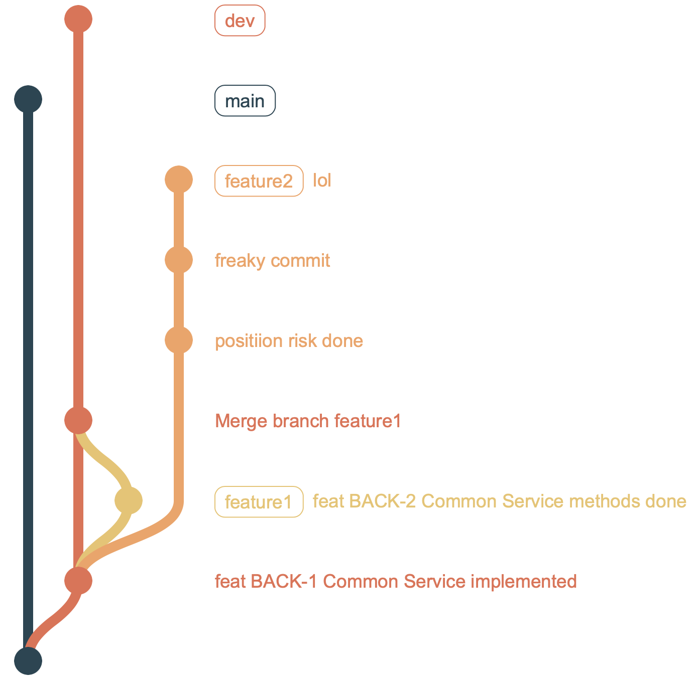
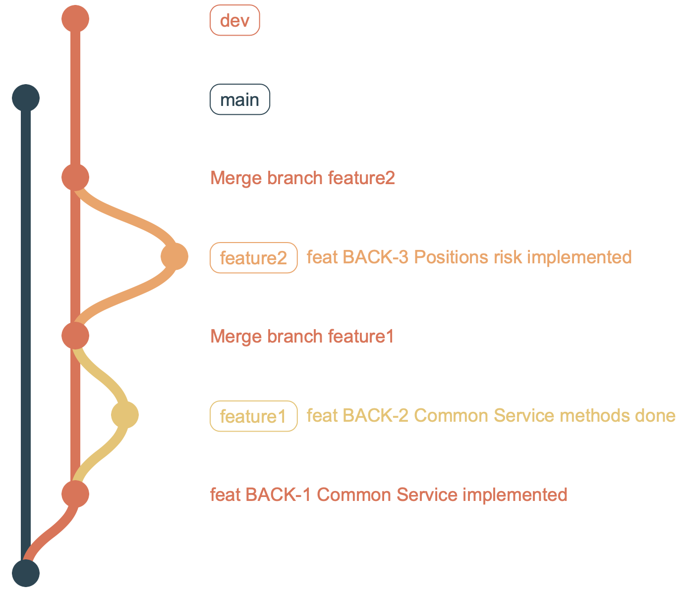

# Задание **GIT**

Перед Вами git-проект. В проекте 4 ветки: `main`, `dev`, `feature1` и `feature2`.

Вы **ведете** командную разработку параллельно с персонажем Bob над сервисом `CommonHolderService`.

Схема проекта:

* `main` - темно-синяя;
* `dev` - красная;
* `feature1` - желтая;
* `feature2` - оранжевая.

Bob работал в ветке `feature1` и успел сделать свою часть раньше Вас. Его работа успешно прошла код-ревью и попала в `dev`.

**Вы** работаете в ветке `feature2` и тоже закончили свою работу.
К сожалению, вы слегка отклонились от флоу проекта. Вам необходимо привести свою ветку в порядок и _вмерджить_ ее в `dev`. Для этого необходимо:

1) Склонировать проект;
2) Перейти в свою ветку. "**Свернуть**" коммиты, выражающие ваши субъективные эмоции (`lol`, `freaky commit` и `positiion risk done`), в один коммит, c сообщением `feat BACK-3 Position risk done`;
3) Вмерджить полученный коммит в `dev` придерживаясь представленной **схемы** (Это важно):

Получившийся результат представить в виде скриншота:
* Результата выполнения  команды `git log --graph`;
* (ИЛИ) Графа веток в вашей любимой программе по работе с git (напр. IntelliJ IDEA).

Время: 30 минут